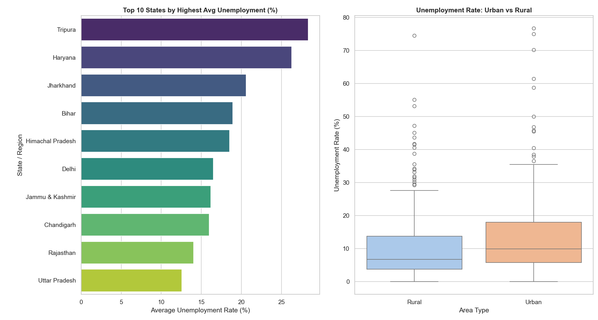

# Unemployment Analysis with Python

This project focuses on analyzing the unemployment rate dataset in India, specifically examining the trends, variations, and the economic impact across different states and regions. The analysis involves data cleaning, exploratory data analysis (EDA), and data visualization using Python.

## Task Objectives
* **Data Cleaning & Exploration:** Process the dataset to handle missing values, formatting issues, and structural inconsistencies.
* **Regional Analysis:** Identify key patterns and seasonal trends in unemployment rates across various Indian states.
* **Sector-wise Comparison:** Analyze and compare the unemployment dynamics between Urban and Rural sectors.
* **Policy Insights:** Present visual data insights that can potentially inform economic or social policies.

## Dataset
The analysis is performed on the dataset named `Unemployment in India.csv`, which contains key metrics such as:
* **Region:** The Indian state/union territory.
* **Date:** The timeline of data collection.
* **Estimated Unemployment Rate (%):** The percentage of the unemployed workforce.
* **Area:** Urban or Rural sectors.

## Technologies Used
* **Python 3**
* **Pandas** (Data Manipulation)
* **Matplotlib** & **Seaborn** (Data Visualization)

## Project Visualizations & Insights

Below are the key analytical insights generated from the script:



### Key Takeaways from the Output:
1. **Top Affected Regions:** The bar chart on the left highlights the top 10 states with the highest average unemployment rates, with **Tripura** and **Haryana** leading the chart.
2. **Urban vs Rural Disparity:** The boxplot on the right displays the distribution of unemployment rates. It indicates that **Urban areas** generally experienced a higher median unemployment rate compared to **Rural areas**.
3. **Anomalies/Outliers:** The prominent outliers (dots reaching up to 70%-80%) represent sudden, drastic surges in unemployment during specific months, capturing severe economic shocks such as the Covid-19 lockdown phases.

## How to Run the Project

1. Clone this repository or download the project files.
2. Ensure you have the dataset `Unemployment in India.csv` in the same directory as the script.
3. Install the required dependencies:
```bash
   pip install pandas matplotlib seaborn
